<p align="center">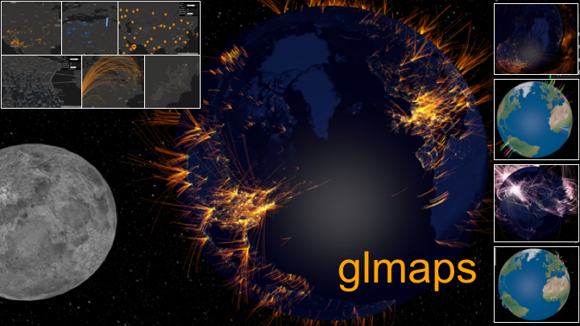</p>

<h1 align="center">glmaps</h1>

<center>

时空数据可视化示例代码集与学习教程。

[](https://www.codacy.com/app/hijiangtao/glmaps?utm_source=github.com&utm_medium=referral&utm_content=hijiangtao/glmaps&utm_campaign=badger)
[](https://www.npmjs.com/package/glmaps)
[](https://github.com/hijiangtao/glmaps/releases)
[](https://www.npmjs.com/package/glmaps)
[]() 
[](https://github.com/hijiangtao/glmaps/issues) 
[](https://github.com/hijiangtao/glmaps/pulls) 
[](https://github.com/hijiangtao/glmaps/blob/master/LICENSE) 

[](https://nodei.co/npm/glmaps/)

</center>

## README 

[英文](./README.md) | [中文](./CN.md)

## glmaps 是什么？

glmaps 是一个包含多个时空数据可视化示例代码集与学习教程的开源项目。该项目中的可视化效果基于可视化库 `three.js` 与 `deck.gl` 实现，非常容易上手，希望本项目对正在时空可视化学习之路上探寻的你有所帮助。

我录制了一段短视频用于展现 `glmaps` 的可视化示例效果，你可以在 [YouTube](https://youtu.be/dddmamIAYj8) 或者[腾讯视频](https://v.qq.com/x/page/x0841840qwl.html)查看。

从零开始学习时空数据可视化的第一篇文章已经发布，文中全面介绍了这个项目都包含什么。你可以根据你的阅读习惯在 [Meidum](https://medium.com/@hijiangtao/data-visualization-examples-and-tutorials-from-scratch-with-glmaps-2b93f478607f)，[知乎](https://zhuanlan.zhihu.com/p/57548743)或者[我的博客](https://hijiangtao.github.io/2019/02/24/Learn-Spatio-Temporal-Data-Visualization-with-glmaps-from-Scratch/)进行查看。

## 目录

1. [概览](#概览) - 快速查阅 `glmaps` 都包含哪些数据可视化形式
2. [ZERO](#ZERO) - 在你进一步阅读本项目之前，想对你说的一些话
3. [Demo](#Demo) - 在本地运行可视化 Demo
4. [从零开始学习时空数据可视化系列教程](#从零开始学习时空数据可视化系列教程) - 暂定八篇
5. [安装](#安装) - 本地安装 `glmaps` 并开始试用（可选）
6. [用法](#用法) - 用法示例
7. [文档](#文档) - `glmaps` API 文档（TBD）
8. [背后的故事](#背后的故事)
9. [其他学习资源](#其他学习资源) - 社区其他开放的学习资源推荐，供进一步学习阅读

## 概览

`glmaps` 现包含有如下几种可视化形式，更多案例正在丰富中。其中 `2.5D` 意指在2D地图上绘制2D或者3D的物体，`3D` 意指完全在三维空间中实现时空数据的可视化效果。

|类型|描述|效果|支持动画|支持聚类|
|---|---|---|---|---|
|3D / Curve|THREE.BufferGeometry()| [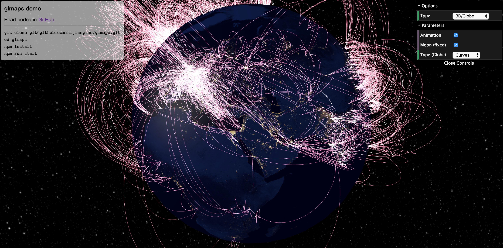](./src/globe/index.js) | Yes | No |
|3D / Mover|THREE.SphereGeometry()| [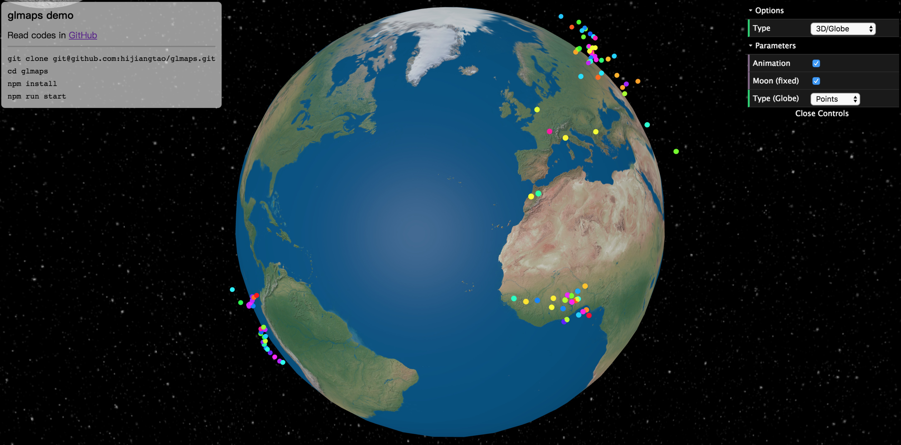](./src/globe/index.js) | Yes | No |
|3D / Cube|THREE.BoxGeometry()| [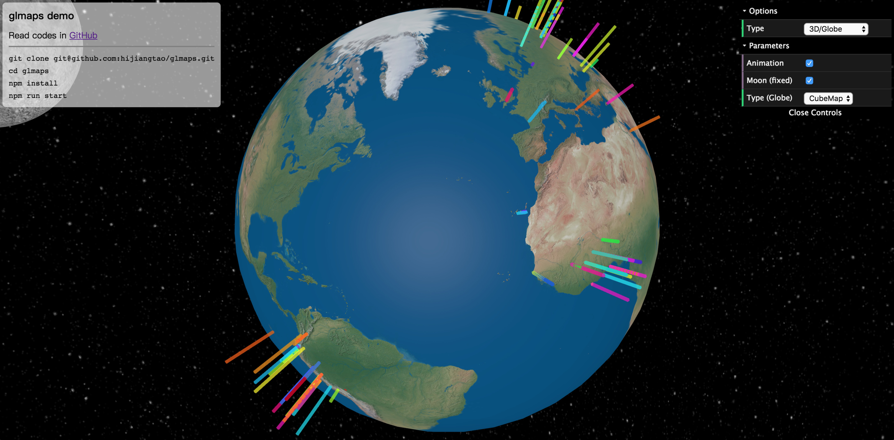](./src/globe/index.js) | No | No |
|2.5D / Icon|与 deck 示例一致，无更改| [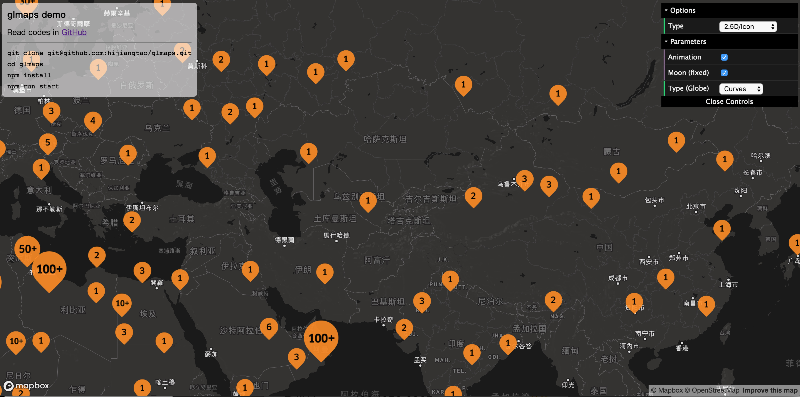](./src/layers/IconLayer/index.js) | No | Yes |
|2.5D / Brush|支持弧线动画| [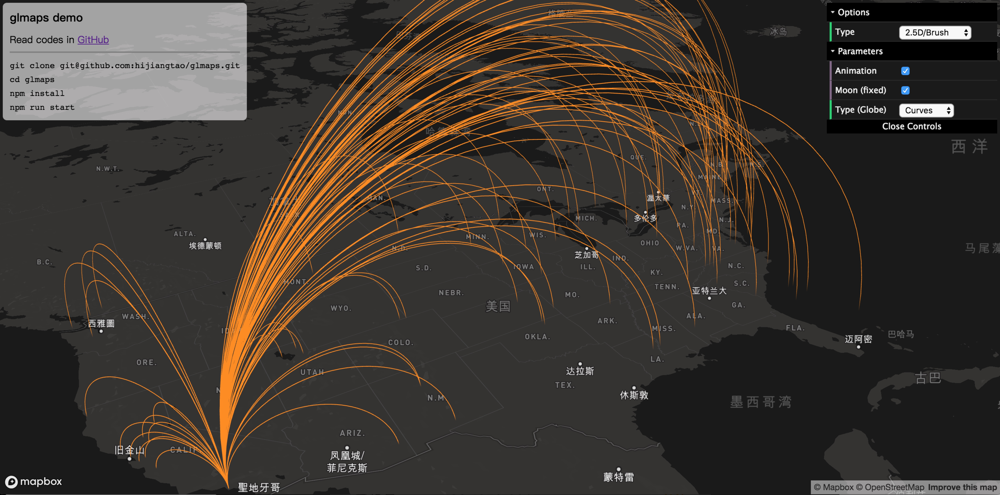](./src/layers/ArcLayer/animate.js) | Yes | No |
|2.5D / Scatter|支持淡出动画| [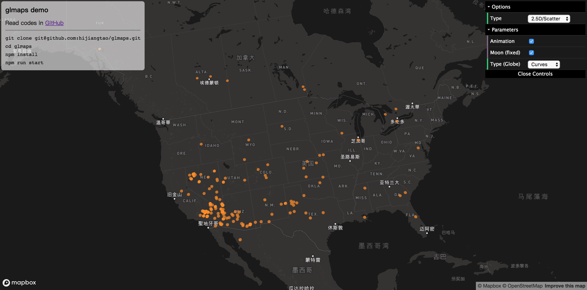](./src/layers/ScatterplotLayer/index.js) | Yes | No |
|2.5D / Hexagon|支持排序筛选| [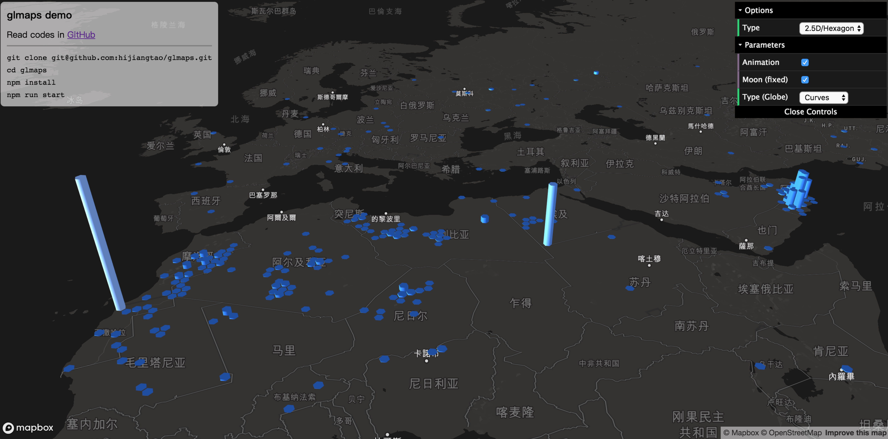](./src/layers/HexagonLayer/index.js) | Yes | Yes |
|2.5D / Grid|支持排序筛选| [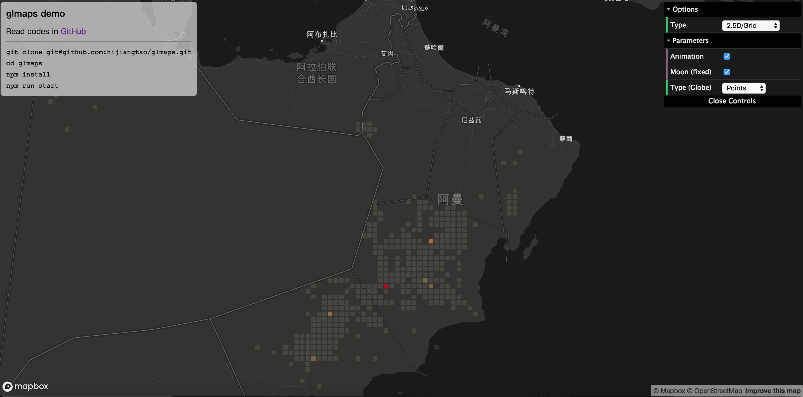](./src/layers/ScreenGridLayer/index.js) | No | Yes |
|2.5D / Trip|与 deck 示例一致，无更改| [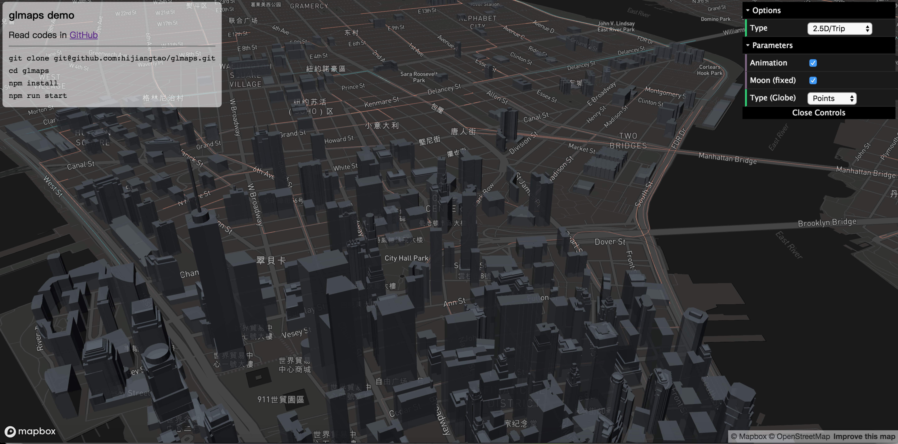](./src/layers/TripLayer/index.js) | Yes | No |
|[2.5D / Cube](./src/layers/HexagonLayer/primitive.js)|支持排序筛选| [](./src/layers/HexagonLayer/primitive.js) | No | No |
|Other / Segment|与飞线动画效果一致| [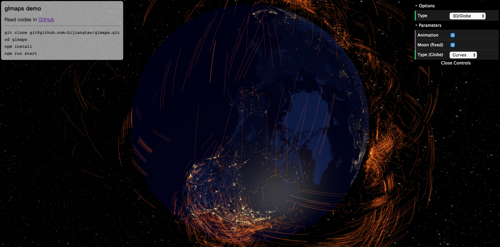](./src/globe/index.js) | No | No |
|Other / Moon|地月系统| [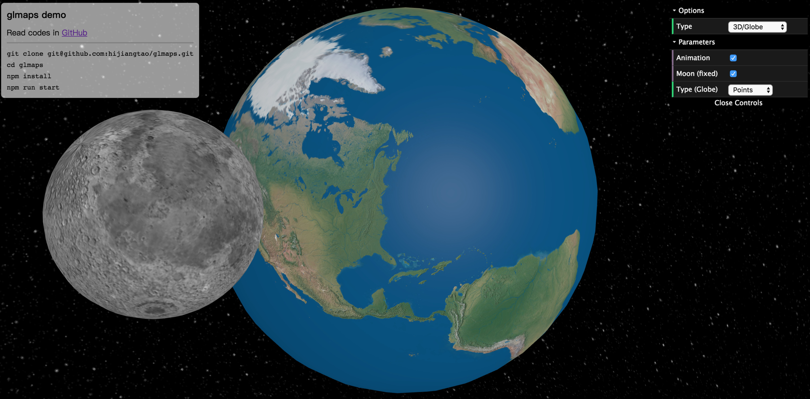](./src/globe/index.js) | No | No |

## ZERO

首先感谢你对 `glmaps` 项目的关注。在你进一步阅读本项目之前，想对你说的一些话。

**Q1: 除了列出的可视化框架，`glmaps` 项目还用到了哪些 Web 技术?**

从 16.8.0 开始，**Hooks** 便正式登陆 React，`glmaps` 在开发过程中也从中受益很多。如果你还不了解 React Hooks，建议先查看 [Introducing Hooks](https://reactjs.org/docs/hooks-intro.html) 了解大概，因为 `glmaps` 在多处使用到了各类 Hooks。另一方面，由于 deck.gl 利用了 **WebGL2** 特性进行可视化绘制，所以在查看 demo 前请确保你的浏览器支持这项技术。你可以通过 <http://get.webgl.org/> 或者 <https://get.webgl.org/webgl2/> 网站来查看你的浏览器对 WebGL(2) 的支持情况。  

除此外，由于 `glmaps` 未采用类似 create-react-app 这样成熟的脚手架进行搭建，而是我按需在构建流程上对 webpack 及 Babel 中的功能进行组合，因此在打包构建方面一定还存在诸多需要继续完善的地方。若你在本地运行 Demo 时遇到任何报错，我相信这都可能是 `glmaps` 本身的问题，而非你的问题，欢迎通过 [issues](https://github.com/hijiangtao/glmaps/issues/new) 和我交流讨论。

**Q2: 可视化初学者该如何利用这个项目学习？**

我比较建议你采用如下顺序配合 `glmaps` 进行学习：
  - 先学习如何在你的项目中引入 three.js 以及 deck.gl，了解基本的使用、项目创建，这部分内容直接在 three.js 与 deck.gl 官网便可找到。尝试根据教程，试试画出你的第一个图形；
  - 大概扫一下这两个框架的主 API 都有哪些，并试试下些官方 demo 在本地运行，感受下这些框架在实现可视化上的巨大能力；
  - 跟着「从零开始学习时空数据可视化系列」教程一步步把 glmaps 中涉及到的可视化案例都实现一遍；如果你对 three.js 与 deck.gl 有过一定的尝试，你也可以直接参考我在 `src` 文件夹中抽象出的代码；
  - （可选）尝试通过 `npm install glmaps --save` 在你的 demo 中引入 glmaps 进行展现；
  - 按照你的理解重写 `glmaps` 示例代码，并为他添加更多特性；
  - 恭喜你已经成功入门基本的时空数据可视化编程！你现在可以更加深入地了解 three.js 或者 deck.gl，并更加自信地创作出更好的可视化作品。

在完成这些学习后，你将可以独立实现如上列出的几种可视化形式作品，而个人认为这些形式已经大致包含了基本的时空可视化类型。

**Q3: 如何参与到 `glmaps` 项目中来？**

`glmaps` is still at the very beginning period of my thoughts, you are welcome to oepn ISSUE, PR or email me, if you have any ideas on how to make `glmaps` better for visualization beginners:
  - Participate in implementing tutorials together;
  - Contribute codes to `glmaps` with [PR](https://github.com/hijiangtao/glmaps/pulls) (such as imporve `mover` animation in `Globe`);
  - Speak out your doubts in learning data visualization with [issues](https://github.com/hijiangtao/glmaps/issues/new);
  - Tell me your advice on how to make `glmaps` better with [issues](https://github.com/hijiangtao/glmaps/issues/new);
  - Other aspects not included yet.

**Q4: `glmaps` 的更新策略？**

前两天云舒在朋友圈的动态突然成了热点新闻，其中我非常赞同第一句的后半句「特地写出来大家看到，省得我改变心意」，`glmaps` 也是在这种环境下诞生的。

不要误解，我不离婚，我只是想说即便 `glmaps` 还处于初期阶段，我仍决定现在把它分享出来。起初，这个想法诞生于两个多月前，我曾在问题「[作为前端工程师的你在深入研究哪些领域？](https://www.zhihu.com/question/303354718/answer/558177026)」中说到新的一年要多搞搞数据可视化，但由于工作忙碌与天生懒惰，于是一直在给自己找往后拖延的借口。

现在把它分享出来，一方面是代码层面在基本功能上已完善，另一方面是想通过公开来鞭策自己按时完成剩余文章的编写，即「自我催更」。由于平时还有工作要完成，所以我会利用好晚上及周末的时间来逐步完善这个项目，step by step。

## Demo

打开浏览器输入 <https://localhost:8080> 在本地查看 glmaps 演示 Demo 吧。感受一下 `three.js` 与 `deck.gl` 在数据可视化上带给开发者的能力有多强大。

```
git clone git@github.com:hijiangtao/glmaps.git
cd glmaps
npm install
touch devconfigs.js
```

由于2.5D地图底图由 Mapbox 提供，所以该处需要自行配置一个 Mapbox Token，存在以上生成的 `devconfigs.js` 文件中，文件中内容格式如下（将 pk 开头的那一长串字符串替换为实际 Token 即可，Mapbox Token 配置请移步[这里](https://account.mapbox.com/access-tokens/)）：

```
// devconfigs.js
const MAPBOX_TOKEN = 'pk.eyJ1IjoiaGlqaWFuZ3RhbyIsImEiOiJjampxcjFnb3E2NTB5M3BvM253ZHV5YjhjIn0.WneUon5qFigfJRJ3oaZ3Ow';

export {
  MAPBOX_TOKEN,  
}
```

*注：虽然这样说不太好，但是当你懒得自己申请 TOKEN 的时候，可以巧妙的利用搜索引擎通过关键字搜到别人的不小心传到往上的 TOKEN。比如 <https://github.com/search?q=MAPBOX_TOKEN&type=Code>，排在第一的可用 TOKEN 长成这样 'pk.eyJ1IjoiY3NuIiwiYSI6ImNpdnRvam1qeDAwMXgyenRlZjZiZWc1a2wifQ.Gr5pLJzG-1tucwY4h-rGdA'...*

以上文件配置完成之后，打开命令行继续：

```
npm run start
```

构建完成后会自动打开浏览器页面，你便可以看到效果啦。

## 从零开始学习时空数据可视化系列教程

暂定八篇教程，如有需要可以提 [issue]((https://github.com/hijiangtao/glmaps/issues/new)) 讨论。

* 从零开始学习时空可视化（零） / [three.js 简介与示例教学](https://hijiangtao.github.io/2019/04/03/Learn-Spatio-Temporal-Data-Visualization-with-glmaps-from-Scratch-One/) | [Demo](https://hijiangtao.github.io/glmaps/tutorials/example_three_geometry_hierarchy.html)
* 从零开始学习时空可视化（一） / deck.gl 入门笔记 - TBD
* 从零开始学习时空可视化（二） / 用 React 框架管理你的 three.js 项目 - TBD
* 从零开始学习时空可视化（三） / 用 three.js 画出你的第一个地球 - TBD
* 从零开始学习时空可视化（四） / 深入浅出 three.js 点、线、面、体的实现过程 - TBD
* 从零开始学习时空可视化（五） / 利用 props 与 transitions 让你的 deck.gl 图层动起来 - TBD
* 从零开始学习时空可视化（六） / 手写 shader 给你的 deck.gl 动画另辟蹊径 - TBD
* 从零开始学习时空可视化（七） / 使用 three.js 和 deck.gl 开发的踩坑记录 - TBD

## 安装

安装 `glmaps`，立刻在你的 demo 中使用上它。

```
cd YOUR_REPO
npm install glmaps --save
```

## 用法

glmaps 的初衷是为了帮助那些在时空可视化领域缺乏基础但充满热情的初学者，利用 three.js 与 deck.gl 的能力帮助他们快速入门，因此 glmaps 不是一个为实际生产环境准备的可视化开源库。然而，glmaps 依然允许你像使用其他 package 一样在项目中正常引入，快写些 demo 试试效果吧。

```javascript
import React from 'react';
import {Globe} from 'glmaps';

/**
 * Data format:
 * [
 *   [
 *      source.lat,
 *      source.lng,
 *      target.lat,
 *      target.lng,
 *   ],
 *   ...
 * ]
 */
const Demo = (props) => {
  return (
    <Globe
      data={props.data}
      id={YOUR_MOUNT_DOM_ID}
      animate={true}
      moon={true}
      visType={'curve'}
    />
  )
};
```

更多示例与详细使用说明请见文档。

## 文档

本部分仍处于完善阶段。然而，你现在就可以直接在 `src` 文件夹下查看所有示例代码集。

* [Layers (2.5D Map)](./src/layers/README.md)
  1. ArcLayer
  2. HexagonLayer
  3. IconLayer
  4. ScatterplotLayer
  5. ScreenGridLayer
  6. TripLayer
* [Globe (3D Space)](./src/globe/README.md)
  1. Curve
  2. Mover
  3. Cube
  4. Moon

```
src
├── globe
│   ├── CubeMesh.js
│   ├── Curve.js
│   ├── Mover.js
│   ├── README.md
│   ├── SceneManager.js
│   ├── Tube.js
│   ├── constants.js
│   ├── index.js
│   ├── index.less
│   └── utils.js
├── index.js
└── layers
    ├── AnimationLayer
    │   └── index.js
    ├── ArcLayer
    │   ├── animate.js
    │   └── index.js
    ├── HexagonLayer
    │   └── index.js
    ├── IconLayer
    │   ├── cluster.js
    │   ├── icon-mapping.js
    │   └── index.js
    ├── README.md
    ├── ScatterplotLayer
    │   └── index.js
    ├── ScreenGridLayer
    │   └── index.js
    └── TripLayer
        └── index.js
```

## 其他学习资源

如果你在学习过程中有发现任何有价值的学习资料，欢迎提交 PR 完善本部分，让我们一起把它建设的更好。

### 1. 在线图书

* CN/EN - [WebGL 理论基础](https://webglfundamentals.org/)
* EN - [WebGL2 理论基础](https://webgl2fundamentals.org/)

### 2. 视频教程

TBD

### 3. 相关技术介绍

1. WebAssembly - <https://www.ibm.com/developerworks/cn/web/wa-lo-webassembly-status-and-reality/index.html>

## 背后的故事

TBD

## 联系方式

@hijiangtao

## 协议

MIT
